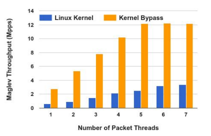
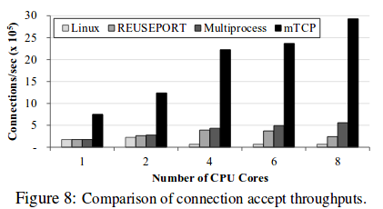
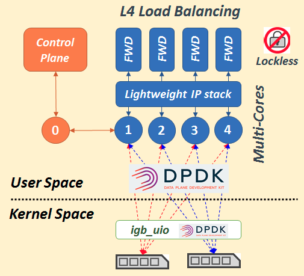
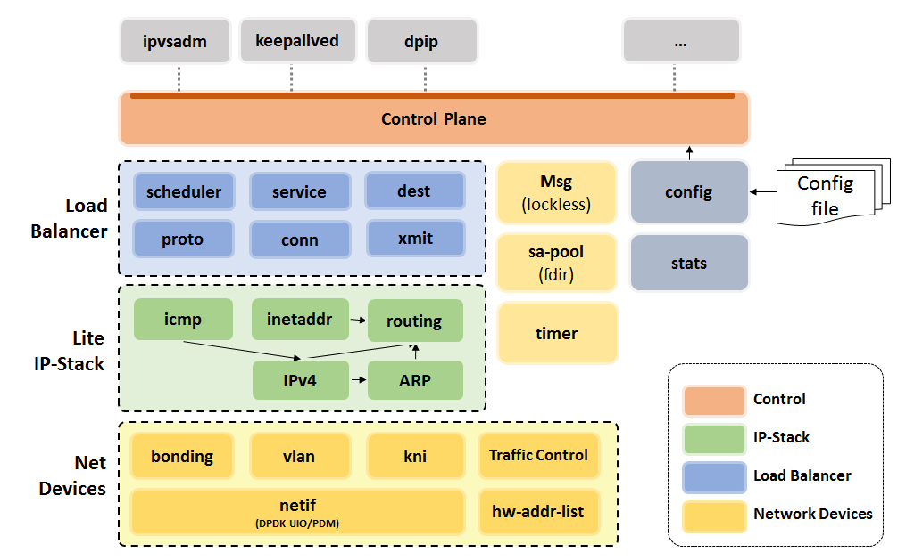

DPVS开发者指南
============

# 目录

[第一部分：DPVS介绍及部署](#part-I)

* [什么是DPVS？](#whats-dpvs)
  - [什么是4层负载均衡](#whats-lb)
  - [项目由来](#prog-history)
  - [DPVS的特点](#dpvs-char)
* [试用DPVS](#try-dpvs)
  - [编译、运行](#build-run)
* [将DPVS用于生产环境](#product)
  - [转发模型](#fwd-model)
  - [调度模型](#shed-model)
  - [单臂与双臂模型](#one-two-arm)
  - [DPVS部署示例](#deploy)
    - [外网集群模式](#external-cluster)
    - [内网集群模式](#internal-cluster)
    - [主备模式](#master-backup)
    - [支持bonding和vlan](#bonding-vlan)
    - [SNAT集群](#snat-cluster)
    - [SNAT-GRE集群](#snat-gre-cluster)
  - [监控与运维](#monitor-admin)
    - [自动化部署](#auto-deploy)
    - [实现基本监控](#moitoring)

[第二部分：DPVS设计与实现](#port-II)

* [LVS为何无法实现高性能？](#why-lvs-not-quick-enough)
* [如何提高性能](#high-perf-howto)
  - [Kernel Bypass技术](#kernel-bypass)
  - [Share-nothing概念](#share-nothing)
  - [避免调度：绑定CPU/Queue](#cpu-affi)
  - [轮询和中断](#polling-interrupt)
  - [其他技术](#high-perf-other)
* [DPVS总体设计](#design-overview)
  - [设计目标](#design-goal)
  - [系统架构](#architect)
  - [模块划分](#modules)
  - [数据流(Big Picture)](#big-picture)
  - [选择与取舍](#consideration)
* [网络设备和数据收发](#netdev-rxtx)
  - [netif和数据收发](#netif)
  - [虚拟设备](#vdev)
    - [kni设备](#vdev-kni)
    - [vlan设备](#vdev-vlan)
    - [bonding设备](#vdev-bond)
    - [Tunnel设备](#vdev-tun)
    - [虚拟设备关系](#vdev-big-pic)
  - [tc: 流量控制](#tc)
    - [Linux的流量控制](#tc-linux)
    - [fifo: 先进先出队列](#tc-fifo)
    - [pfifo_fast: 优先级队列](#tc-pfifo-fast)
    - [tbf: 令牌桶过滤器](#tc-tbf)
    - [match: 规则匹配](#tc-match)
  - [硬件地址管理](#hw-addr)
* [用户态轻量级协议栈](#lite-ip-stack)
  - [公共API函数](#common-api)
  - [ipv4: 简单的IP层](#ipv4)
  - [neigh: ARP实现](#neigh)
  - [route: 路由实现](#route)
  - [inetaddr: IP地址管理](#inetaddr)
  - [icmp: 基本ICMP功能](#icmp)
  - [tunnel: IP-in-IP及GRE隧道](#tunnel)
* [负载均衡与转发](#ipvs)
  - [ipvs: 虚拟服务器](#ipvs-vs)
    - [ipvs基本概念](#ipvs-concept)
    - [ipvs核心数据流](#ipvs-core)
    - [返程数据亲和性](#traffic-back)
  - [xmit: 转发模型](#ipvs-xmit)
    - [FullNAT转发](#ipvs-xmit-fnat)
    - [DR转发](#ipvs-xmit-dr)
    - [SNAT模式](#ipvs-xmit-snat)
    - [NAT与隧道模式](#ipvs-xmit-nat-tunnel)
  - [sched: Real Server调度](#ipvs-sched)
  - [dest: Real Server管理](#ipvs-dest)
  - [service: 虚拟服务管理](#ipvs-service)
  - [proto: 协议转发](#ipvs-prot)
    - [TCP转发](#ipvs-prot-tcp)
    - [UDP转发](#ipvs-prot-udp)
    - [ICMP转发](#ipvs-prot-icmp)
    - [QUIC转发](#ipvs-prot-quic)
  - [laddr: Local IP管理](#ipvs-laddr)
  - [sapool: 地址池管理](#ipvs-sapool)
  - [toa/uoa: 获取真实客户端地址](#ipvs-toa-uoa)
  - [conhash: 一致性哈希](#ipvs-conhash)
  - [数据统计](#ipvs-stats)
* [其他基础部件](#basic-modules)
  - [timer: 高性能定时器](#timer)
  - [msg: 跨CPU无锁通信](#msg)
* [安全相关主题](#security)
  - [黑名单](#secu-blacklist)
  - [防syn flood攻击：syn-proxy](#secu-synproxy)
  - [并发、流量限制](#conn-traffic-limit)
* [DPVS控制面及工具](#control-plane)
  - [sockopt: 控制面](#sockopt)
  - [配置文件](#config-file)
  - [dpip工具](#dpip)
  - [ipvsadm工具](#ipvsadm)
  - [keepalived](#keepalived)
* [性能测试与调优](#perf-tune)
  - [性能测试](#perf-test)
  - [perf与火焰图](#perf-flamegragh)
  - [一步步改进性能](#perf-optimization)

[第三部分：开源合作与展望](#part-III)

* [开源的好处](#why-open-source)
* [DPVS开源的一些经验](#open-source-expirence)
* [持续集成](#ci)
* [自动化测试](#test-automation)
* [如何参与项目](#howto-contribute)
  - [提交bug](#report-bug)
  - [功能开发与Pull Request](#pull-request)
  - [提问与讨论](#ask-question-discuss)
* [项目的未来目标](#future)
* [参考资料](#references)

---------------------------------------------------------

<a id='part-I'/>

第一部分：DPVS介绍及部署
=====================

<a id='whats-dpvs'/>

# 什么是DPVS？

`DPVS`的名字来自与`DPDK`和`LVS`。`LVS`是多年来非常流行的4层负载均衡器，其核心转发部分在Linux内核态实现。而DPDK则是一个快速包处理的库和驱动套件，最早由Intel推出，现在已经成为Linux基金会项目，被广泛应用于各种领域．简而言之，`DPVS`就是“*基于DPDK的高性能4层负载均衡器*”。

> [LVS](http://linuxvirtualserver.org/)最早由大名鼎鼎的[章文嵩博士](http://jm.taobao.org/2016/06/02/zhangwensong-and-load-balance/)开发，随后包括百度，阿里在内的公司对它进行了改造，比如`FullNAT`和`syn-proxy`的引入，还有`SNAT`的patch；如今，随着DPDK等kernel-bypass技术的发展，特别适合对＂４层负载均衡＂这类纯转发设备的性能提升，于是各大公司也纷纷有了DPDK加速负载均衡的项目．

`DPVS`的实现在功能上保留了大部分`LVS`的特性，还引入了一些新的功能．实现过程参考了`LVS`及修改版本[alibaba/LVS](https://github.com/alibaba/LVS)，Kernel网络协议栈等，并利用`DPDK`等技术．成功实现多核线性扩展，成倍于`LVS`的性能提升．关键技术总结如下，

* **kernel-bypass**: 完全用户态实现，一是提升性能，二是方便功能开发、调试．
* **Share-nothing**: 关键数据*per-CPU*化，避免锁的使用（lockless）
* **避免上下文切换**：绑定网卡队列，处理线程和CPU，避免调度切换．
* **批处理化数据收发和处理**：批处理提高效率并采用*Run-to-Complete*模型．
* **Polling**：使用轮询而非内核的中断+下半部poll，专有CPU完全用于转发.
* **无锁化的消息系统**：用于高性能的跨CPU通信.
* 还有 *零拷贝*,*大页内存*，*prefetch* ...

功能方面，`DPVS`则包括了`LVS`的特性和它所没有的一些功能．

* 多种负载均衡转发模式：`FullNAT`，`DR`，`Tunnel`, `NAT`模式．
* 各种*Real Server*调度算法: `RR`, `WLC`, `WRR`, 以及`一致性哈希`.
* 用户态轻量级高性能IP栈：实现了IPv4, ARP，ICMP，路由和地址管理等．
* 集成了`SNAT`模式：支持方向代理的同时、可用于IDC内部进行外网访问．
* 支持`kni`，`vlan`，`tunnel`，`bonding`等多种虚拟设备以适应复杂的IDC环境.
* `TOA`及新引入的`UOA`模块：用于`FullNAT`模式下`RS`获取真实TCP/UDP Client IP/Port．
* 安全和QoS相关：`syn-proxy`, 限并发，限流，黑名单, `tc`等模块．
* 工具支持：`dpip`工具，`keepalived`, `ipvsadm`，`quagga`等支持，用于部署监控。

---------------------------------------------------------

<a id='part-II'/>

第二部分：DPVS设计与实现
=====================

<a id='why-lvs-not-quick-enough'/>

# LVS为何无法实现高性能？

其实LVS的性能瓶颈主要受限于Kernel，这么说也许许多人也许会很奇怪，毕竟Kernel一向给人以高水准，高性能的印象。而且多年来Kernel对网络部分的优化也从未停止，为何会成为性能瓶颈？ 首先，我们先看两组数据，一组是Google `Maglev`的，一组是`mTCP`的，这样对内核性能瓶颈有个直观的印象。

    
    

> 下方左边的图来自Google [Maglev的论文](https://static.googleusercontent.com/media/research.google.com/en//pubs/archive/44824.pdf)，右侧的图来自[mTCP的论文](https://www.usenix.org/system/files/conference/nsdi14/nsdi14-paper-jeong.pdf)。

不难看出，一方面在一个CPU core的情况下，基于kernel的方案在性能上就不如Bypass的方案；另一方面，现代SMP多CPU核的情况下Bypass的方案可以实现性能线性扩展，但是kernel却无法做到。

回到LVS，因为其主要部分ipvs是在内核态实现的，虽然有 *per-CPU连接表*, *缩小lock范围*，*尽早处理(pre_routeing)* 等优化手段，但来自kernel的性能问题依然存在。

### 为何Kernel成为性能瓶颈

那么为什么Kernel会成为性能的瓶颈？总结下来包括几个方面：

* 上下文切换的开销
* 锁的使用影响性能
* 大流量下中断过多（中断风暴）
* 复杂的协议栈导致路径过长

下面我们来以此说明一下。

##### 上下文切换

这个包括用户态内核态的切换，多进程/线程上下文的切换。上下文切换开销非常大应该尽量避免。所以各个application应该尽量将任务和CPU core进行亲核心绑定，就像Nginx的worker所做的那样。此外，不应该采用大量线程或进程的模型，应该让一个绑定了CPU的线程(进程)同时处理多个事务，这样也可以减少切换。同样可以参考Nginx的事件驱动（I/O多路复用+NONBLOCK_IO）的模型。

> 对应事件驱动模型，可以参考“C10K问题”以及具体的实现：Nginx，Lighttpd，libevent等。

##### 资源共享与锁的使用

我们知道，从Unix到Linux时分复用系统的基本目标就是提高资源利用率，使多个用户或者多个进程同时使用OS的资源，并且他们都以为自己独占了资源，多个进程/线程需要共享资源并进行切换，是并发的。而SMP的发展，更是让多个进程线程在物理上并行化。不管怎样，在有资源共享的情况下，一定需要保护资源，不然就会产生竞争条件。那么为了资源不会被竞争破坏只能加上锁（或原子变量，内存屏障）。

锁意味着，当拿不到资源的时候，只能等待（不论是切换出去等，还是忙等）都会造成CPU浪费，降低性能。SMP和进/线程多的情况下问题更加突出。虽然人们采用各种优化锁的技术，读写锁，spinlock，RCU，顺序锁...但是不管怎么锁法，都不如“没锁”来的高效。

但是Kernel资源共享的本质，却不可能没有锁的使用。就它的协议栈来说，虚拟设备需要锁，L2/L3/L4分用需要锁，Netfilter的hooks表需要锁，Conntrack需要锁，路由/ARP/IP地址需要锁，TCP/UDP层有锁，Socket层需要锁，TC(qdisc)需要锁...

Unix/Linux是“通用目的的操作系统”，它们从来就不是为单个进程，某个高性能场景服务的“专用设备”而生。设计之初也不是为SMP多CPU优化的。性能的提升和优化，只能是在资源共享、公平的前提下进行。比如缩小锁的范围，使用合适的锁，有些地方甚至可以per-CPU避免锁的使用，但终究太多资源共享了。毕竟不能破坏多用户、多任务，通用系统，公平这些大前提。因此，在某些特殊的高性能领域内Kernel协议栈表现的不够高效就比较好理解了。包括高速包转发，抗DDoS等。另外一方面，网卡的性能却逐渐提高，10G->25G->40G->100G不成为瓶颈。如果只是为了某个单一类型的应用，甚至硬件都可以是特定的，为什么还有跑一个完整的操作系统(协议栈)呢？

##### 中断模式

我们知道Kernel网卡驱动的收发包部分是中断（硬，软IRQ）和下半部实现的，通过`NAPI`接口实现了“中断加轮询”的方式，一方面利用中断来及时处理响应避免对用户造成延迟，另一方面为了兼顾吞吐量等性能，每次中断处理函数会以一定的配额去轮询(polling)设备的报文。这种机制，再结合各种硬件offload，和软件优化方案，能够最大程度兼顾大部分场景的延时和性能需求。

然而在高性能，高pps的特殊网络应用场景下，这种模式依然显得不够好，当网络I/O（尤其是pps）非常大的时候，简单的通过`top`命令就可以看到CPU被大量消耗在软中断上。虽然可以使用中断/CPU亲核心设置充分利用网卡多队列和多core的能力，但中断本身还是会成为瓶颈的一部分。

DPDK的方案是轮询 。为什么会是“轮询”？ 一提轮询，大家首先想到间隔太短浪费CPU，间隔过长会造成不必要的延迟，怎么设置这个间隔都不好。但是，如果是不考虑CPU浪费，没有间隔，以“死循环”方式进行轮询，每次轮询尝试批量读取和处理数据，那么延迟问题能解决和性能也能大幅提升了。毕竟这个CPU全力在处理包的接收。

##### 强大也复杂的协议栈

即便每个函数都优化到极致、不消耗很多CPU，但是如果一个数据通过的函数调用链过长，其累计的性能消耗也会比较大。Kernel实现了太多的复杂的功能，Netfilter及相关的表和规则，ConnTrack系统，各种各样的QoS，GRO/TSO。为了封装不同协议、驱动等实现的抽象封装。这意味着一个数据包在内核中需要通过的函数非常的多，路径非常长，小的消耗积少成多。看看下图，Kernel网络栈的收发部分是不是特别的“高”？ 因为多层函数调用累计的消耗所占的比例就不算小了。在某些特殊的场景，其实不需要那么多的功能。

   

> 图片来自ACM论文：https://queue.acm.org/detail.cfm?ref=rss&id=2927301

同时也可以看到，用户态/内核直接的数据拷贝是否消耗CPU。不过LVS的核心转发部分ipvs是内核态实现的，没有copy的问题。

##### 数据拷贝

> 首先说明，这点和LVS的性能可能关系没有那么大，因为内核态实现的ipvs，是不需要把数据copy到用户态再拷回去的，只是说数据拷贝非常影响性能。

网络数据通过内核和用户态边界的时候，不但有系统调用的开销，还需要一次额外的数据拷贝。如果能从网卡DMA到内存后，整个处理过程不存在额外的拷贝，也能提高性能。Linux的Sendfile机制就可以避免这种拷贝开销。而Kernel-bypass方案可以避免用户态/内核直接的拷贝，对于用户态转发数据而言会有两次拷贝。

# 如何提高性能

那么怎么怎么才能提高性能呢？ 经过上面的分析，我们知道传统LVS在高并发高流量下的性能瓶颈主要在Kernel。首先，简单直接的方法“Kernel-bypass”，绕过了Kernel既然也就没有了那些性能约束了。当然，事情并没有那么简单，我们从"Kernel-bypass"开始，结合其他的一些比较重要的技术，逐步分析如何综合利用他们来提高性能。

### 使用Kernel-bypass

###### 优点：高性能

使用Kernel-bypass技术可以避免kernel的瓶颈，解决上述提到的几个问题，带来成倍的性能提升。

除了性能之外，其他的好处包括：

###### 优点：用户态相对Kernel开发、和被采纳周期更短

看看QUIC和TCP的改进就知道了，很多东西可以在QUIC上快速实验和应用，但是在TCP层实现意味着漫长的内核开发、采纳时间.另一个问题是无法强制用户去经常去升级Kernel，但升级一个app却十分常见。

###### 优点：用户态开发，调试更方便

各种各样的调试和profiling手段，工具。程序挂了直接重启就行，解决coredump十分方便。虽然内核调试的技术也很多，但相对用户态而言显然更困难。何况招一个写应用的程序员，相对一个精通Kernel的程序员也方便的多（这主要是应用开发的需求比较多决定的）。

不过没有免费的午餐，我们还是要看看kernel-bypass面临的问题，

###### 缺点：太费事（too expensive）

Kernel被bypass之后，协议栈也就没有了，我们需要在用户态重建TCP/IP协议栈，想象一下这里有多大的effert！而且重新实现一个协议栈，多少人有把握哪怕只是完成？更别说它能和Kernel一样稳定，能应付各种正常、异常情况，适用不同的场景保持高效和无bug？

这里说明两点，

  1. 从0开始很难，但我们可以站在别人的肩膀上，事实上目前已经有不少各有特色的用户态协议栈了，其中有些是高性能的。seastar, mTCP, LKL, ODP/OFP, LwIP, f-stack, libuinet。比如f-stack，经过自研协议栈后最终还是决定使用了成熟的BSD栈（借鉴了libuinet），然后利用share-nothing思想，让每个CPU运行独立的stack，互不影响。这个做法比较巧妙，即带来客观的性能提升，又有成熟完善的协议栈支撑功能。再比如说LwIP其实更适合嵌入式系统，不太适合服务器。

  2. 有些应用场景其实并不需要完整的协议栈，比如说L2/L3数据转发，比如说4层负载均衡。4层负责均衡只需要4层端口信息（或者app的某个标识），并不需要实现完整的TCP，Socket层。只是实现3层功能（IP，ARP，Route，ICMP）虽然也很麻烦，但比起实现一个TCP或者Socket来说就好很多了。

###### 缺点：失去了多任务的能力

没有了内核协议栈，使用定制的协议栈保证高性能，我们也就同时失去了多任务的能力。网卡会被bypass技术（如DPDK）完全接管，普通的app看不到他们也无法直接使用，使用用户协议栈为了高性能而又隔离了app，他们可能无法在同一个系统上同时运行了。

> 网卡被某个DPDK app接管，就不能在它上面跑ssh这样的应用了，不过可以通过kni技术解决。但kni只是解决一部分问题，毕竟这部分(SSH)数据又通过了协议栈，kni做不到高性能。

不过，这对于单一目的的系统，比如一个服务器只用来做负载均衡器或Web Server就没有这个问题。这也是“通用”与”专用”的例子。

###### 缺点：许多Kernel配套功能用不了

比如ifconfig, ip没有了，tcpdump也很难真正应用，/proc文件没有了，现有的基于这些工具的profiling和监控、部署脚本，一整套配套的东西就无法使用了。更别谈iptalbes，和基于内核调参的优化了。这会给调试、排查问题和运维造成麻烦，还会增加工具、脚本等套设施开发的成本。是的，用户态应用本身的开发是变方便了，相关配套的成熟的东西却少了。

###### 缺点：稳定性、安全等

通过kernel-bypass，不谈工作量。新用户态协议栈稳定性（包括上述的f-stack, mtcp, seastar等）来看，它们显然没有经过Kernel那么多年的沉淀，而且有多少项目能有Kernel那么数量庞大又顶级的程序员参与，长期的高质量的保证（包括各个稳定发布版本）？除了稳定性，安全性如何保证，包括安全相关的功能和代码本身的安全性会不会有很多漏洞？这些也是问题。

###### 应用场景

了解了kernel-bypass的优缺点，就可以来看看它适合的应用场景了。总得来说这类场景有两个特点：基于kernel的方案无法满足性能要求，包括“高性能要求”及“低延时要求”，且kernel-bypass实现不需要过多的effert，比如需要整个协议栈。

* 高频交易：需要超低延时，用户态定制的协议栈和polling模型可以保证低延时。
* 数据转发：这个属于高性能要求，包括2,3层交换、路由，和负载均衡器等。
* 抗DDoS：DDoS的大量的packet会在Kernel造成中断消耗过多CPU的问题，Kernel的pps能力不足。

可以看到其实数据转发和抗DDoS并不需要完整的协议栈支持，所以是应用kernel-bypass的合适场景。

> 当然Kernel也在不停的进化，比如说我们这里的提到的开源Ali/LVS，它的内核还是2.6.32，已经是非常“老”的Kernel了。Kernel对性能的追求从未止步过，多年前的"中断+轮询"，设备驱动napi/上下半部改造，RPS/LRO/GRO/..., REUSEPORT, 等等各种优化的引入，包括最近的XDP/eBFP方面的努力（也许正是针对DPDK这种kernel-bypass的威胁），facebook也开源了基于XDP的负载均衡器。还有不断进行中的各种TCP层，Socket层的优化，手段如此之多。所以说`Kernal-bypass`技术和Kernel自身的演化和对比应该是个动态的过程。

### Share-nothing

提高性能的另一个关键点是 *share-nothing* 的思想。之前分析kernel为何是瓶颈的时候提到，其中一个重要的原因是“资源共享和锁的大量使用”。如何才能避免锁的使用？那就是利用*share-nothing*思想，如果每个core（或者task）不需要再共享资源了，那么也就不需要用锁去保护这些资源了。

内核在CPU间共享了大量数据，比如全局UDP Hash表，Netfilter Hook表等。还有之前版本内核的accept队列。根据`mTCP`的论文，Kernel的几大性能限制包括：

1. 缺乏连接本地化
2. 共享文件描述符空间
3. 低效的per-packet处理
4. 系统调用开销。

其中，前两点和资源共享和锁相关。如果让诸如TCP/UDP的连接表（或者LVS连接表）做到per-core化（即CPU core本地化），就能大幅提高性能。因为连接表的插入、查询和删除在高并发场景下是一个显然的热点。

然而做到这点并不容易，因为会引入额外的复杂度，比如“返程数据亲核心问题”，比如“配置同步的问题”后面会详细分析如何实现”关键数据的per-core化及无锁化”。

### 避免上下文切换

上下文切换的开销是非常大的，为何Nginx这样的事件驱动服务器可以解决 *C10K问题*，性能远超当时采用多进程模型的Apache。即便采用进程（线程）池也紧紧能缓解下问题。现代的高并发的解决方案，通常都是单个进程（线程）结合IO复用技术（`epoll`/`kqueue`等）来处理大量的用户请求，来避免上下文切换的开销。

虽然使用kernel-bypass情况下无法直接使用epoll这样的复用技术（像`mTCP`/`f-stack`那样自己封装了一个类似的API），不过依然不阻碍通过“避免上下文切换”这样的途径提高性能。

具体到负载均衡器，为了避免上线文切换，我们可以让多个负责转发task和特定cpu core进行亲和性设置，再禁止其他进程调度到这些CPU，这样每个cpu只专注于运行一个task，没有多进程（线程）并发也就没有切换的必要。再结合网卡队列和task的绑定，让同一个TCP/UDP connection交由特定的CPU处理，在CPU间分离了connection表、避免锁的使用，进一步提高效率。

概念上往外拓展，避免上下文切换也包括避免用户态内核之间的切换，避免中断和进程上下文在之间的切换。使用kernel-bypass自然就不存在用户内核态的切换问题了，对于后者中断的问题，我们再详细讨论。

### 使用Polling而非中断

之前介绍内核瓶颈的是就讲到中断模式相对牺牲CPU周期来轮询，显然后者的效率更高。当总是有数据到来的高性能要求环境下，不妨使用中断代替轮询来实现高性能。实践的角度，如果某个业务流量确实不大或者有较大的波动，可以采用业务混部的方式保证服务器有一定的大流量，避免CPU的浪费。

### 避免数据拷贝

网络数据通过内核和用户态边界的时候，不但有系统调用的开销，还需要一次额外的数据拷贝。如果能从网卡DMA到内存后，整个处理过程不存在额外的拷贝，也能提高性能。Linux的*Sendfile*机制就可以避免这种拷贝开销。而Kernel-bypass方案（比如利用`uio`）可以避免用户态/内核直接的拷贝，对于用户态转发数据而言会有两次拷贝。

> 当然内核态实现的ipvs，是不需要把数据copy到用户态的，只是说使用kernel-bypass,是可以实现zero-copy的。

### 其他技术

这里简单列一下其他提升性能的技术，有些是DPDK自己提供的，有些是些类似“最佳实践”的东西。这些就不再详细分析了。

* 使用预分配的内存cache

  比如Kernel的`kmem_cache`，比如DPDK的`mempool`，都是这个优化的例子。使用原生的malloc/free在频繁分配释放的场景下确实太慢了。

* NUMA awareness

  NUMA结构中，每个CPU访问本地存储快于访问其他CPU的存储。所以，让合适的CPU core去访问和它们在同一个NUMA节点的NIC能够提高效率。

* Hugepage

  这个是DPDK的自带特性，使用大页内存降低TLB miss。

* Prefetch

  合适的使用预取，降低cache miss。

* 分支预测，内联函数

  合理使用`likely`和`inline`，这些都是Linux，C语言编程的良好实践。

# DPVS总体设计

### 设计目标

上文介绍了LVS的性能瓶颈及如何通过一些技术手段提高性能，下面我们以DPVS为例看看如何实现一个高性能的4层负载均衡器。先从大的视角开始，看看DPVS的目标和总体设计架构。坦率的说，有些设计要求是又开始就有的，比如性能提升的要求，兼容LVS的要求，有些则是实现和应用过程中逐步演化和加入的，并非在项目开始的时候就有很明确的目标，比如VLAN，SNAT，一致性hash支持。这个在软件设计中比较常见，很难一开始就设计出没有漏洞的完美系统。分阶段快速迭代而非憋大招、每年发布一个版本也更符合快速变化的互联网环境。因此，不论目标的先后，在此把这些要求和目标统一的描述一下，从大的方面看下DPVS需要完成怎样的事情。

DPVS首要的设计目标是“高性能”，这样可以带来成本上的优势，而减少机器的使用又能带来运维方面的难度。如果无法实现性能的提升，项目的意义就不足了。为了实现高性能，会用到上述提到的大部分技术，Kernel-bypass, Share-nothing思想及无锁化编程等，避免上下文切换，轮询，无锁的跨CPU通信等。

4层负载均衡提供的高可用特性，包括Real Server（RS)的高可用和4层负载均衡器（LB）本身集群的高可用。其中，RS的高可用保证通过LB设备对RS进行健康检查实现，LVS的健康检查使用`keepalived`，如果健康检查失败`keepalived`会实时在LB上将该RS的权重设置为0。LB集群的高可用通过ECMP和keepalived共同完成，其中ECMP可以通过OSPF/BGP等实现，LB将服务的VIP通过OSPF等路由协议通告给上游交换机，交换机使用ECMP技术将不同的流量均衡到LB集群内的机器，如果检测出LB不可用或该VIP所有RS不可以，可以把VIP从LB
摘除，及不再通过OSPF等通告。OSPF通过开源套件quagga的ospfd程序来实现。

我们知道，不论`keepalived`还是`ospfd`都是运行在Linux接口、Linux协议栈及Socket API的。而DPDK这样的Kernel-bypass应用，会完全接管网卡。导致无法直接使用`keepalived`和`ospfd`，解决的方案是使用DPDK的`kni`接口，将`keepalived`和`ospfd`关心的数据通过`kni`传递到Linux协议栈然后递交给`keepalived`/`ospfd`，他们要发送数据的时候，则通过kni接口发送到DPVS再从DPDK接管的网卡出去。

> 具体实现是将通过了路由查找（目标是本机IP，或者多播、广播地址），且DPVS又不需要的数据交给kni。

为了替换原来的LVS，必须实现其大部分功能：FullNAT、DR等转发模式，RR,WRR,WLC等调度模式，Syn-proxy功能，Service/RS/Conn管理。也包括TOA，连接模板，fast-xmit等。因为使用DPDK绕开了Kernel协议栈，我们需要一个简单的协议栈功能，它不需要TCP/UDP和Socket的实现，但是需要基本的IPv4，ARP，路由，地址管理和基本的ICMP的实现。而且需要性能上的保证，不能成为瓶颈。适应负载的IDC部署环境，需要支持vlan, bonding, tunnel接口等，这些本来在Linux上现成的功能，需要在DPVS中实现。

我们从总体架构开始逐步分析DPVS的实现。

### 总体架构

DPVS的总体架构图如下，其中几个主要的点包括。

   

* Master/Worker模型

  采用经典的Master/Worker模型，Master处理控制平面，比如参数配置，统计获取等。Worker实现核心负载均衡、调度、数据转发功能。DPVS使用多线程模型，负载均衡逻辑并没有Nginx那么的复杂，也不需要由Master去管理、监控worker进程是否活着，甚至支持热升级等，使用多线程可以满足要求。

  使用该模型后，将master及各个worker和CPU core绑定，并且禁止这些CPU被调度。这些core只运行dpvs的master或者某个wroker，以此避免上下文切换，别的进程不会被调度到这些CPU，worker也不会迁移到其他CPU造成cache miss。

* 网卡队列/CPU绑定

  现代的网卡支持多个队列，可以和SMP架构的多core有效结合提高效率，让不同的core处理不同的网卡队列的流量，分摊工作量，实现并行处理和线性扩展。在Linux下，我们通过中断亲和性的设置，将不同的队列中断设置到不同的core。在DPVS上，具体的绑定方法则是，由各个worker处理不同的NIC队列，每个worker处理某网卡的一个RX queue，一个TX queue。

* 关键数据per-core及无锁化

  Kernel性能问题的一大原因就是资源共享和锁。所以，被频繁访问的关键数据需要尽可能的实现无锁化，其中一个方法是将数据做到per-core化，不同的core只处理自己本地的数据。不需要访问其他cpu core的数据，这样就可以避免加锁。就DPVS而言，connection表，arp表，路由表等，都是频繁修改或者频繁查找的数据，需要做到per-core。

  具体实现的时候，连接表和arp/route表并不相同。对于connection表，高并发的情况下，不光是查找，还会被频繁的添加、删除。可以让每个CPU维护的是不相同的表，不同的网络flow（TCP/UDP）按照n元组被定向到不同的CPU，在此cpu上创建、查找、转发、销毁。同样的flow（即n-tuple匹配）只会出现在某个cpu，不会落到其他的CPU上。这样就可以做到不同的CPU只维护自己本地的表，无需加锁。当然，只看接收的话，网卡的RSS可以做到将同一个flow hash到同一个队列（及相应的在该队列上接收的CPU），但实现同一个flow *双向* 的数据都落在同一个CPU core上就没那么容易了。后面的 *返程数据亲和性* 问题会仔细讨论如何解决这个问题。

  另一方面对于arp和路由表，这种本来系统“全局”的数据，每个cpu都是要用到它们的。如果不采用 *全局表+lock保护* 的方式，而要做成per-core，也得要让每个cpu需要同样的视图，也就是需要维护同样的表。好在arp，路由不像connection表那样会频繁的变化，最多就是配置的时候，或者收到arp request/response，表项超时的时候的时候修改下表。对于这两个表，采用了跨cpu无锁同步的方式，虽然在具体实现上有小的差别，本质上就是通过跨cpu通信（路由是直接传递信息，arp是clone并传递分组给别的cpu），将表的变化同步到每个CPU。

  不论用了什么方法，表做到了per-core之后没有了锁的需求，性能也就能提升了。

* 用户态轻量级协议栈

  4层负载均衡并不需要完整的协议栈，但还是需要基本的网络组件，以便完成和周围设备的交互(arp)，确定分组走向(route)，回应ping请求，健全性检查(分组完整性，checksum)，以及IP地址管理等基本工作。

* 跨CPU无锁消息

  其实之前已经提到过这点了。首先，虽然采用了关键数据per-core等优化，但跨core还是需要通信的，比如：

  1. master获取各个worker的各种统计信息
  2. master将路由，黑名单等配置同步到各个worker
  3. master将来自kni的数据发送到worker（只有worker能操作DPDK接口发送数据)

  既然需要通信，就不能互相影响、存在相互等待的情况影响性能。为此，我们使用了DPDK提供的无锁ring，这样从底层保证通信是无锁的。当然，我们在此之上封装一层消息机制支持一对一，一对多，同步或异步的消息。应该尽量使用异步消息进行各个core的逻辑解耦，解除依赖，不要等待而影响性能。Master作为control-plane短时间等待下各个worker回复是可以的，worker绝对不能死等其他人的回复而影响转发。

### 模块划分

了解了总体架构后我们看下具体的模块划分，从下至上包括

* 网络设备层
* 轻量级IP协议栈
* 负载均衡层
* 基础功能模块
* 控制面

   

##### 网络设备层

网络设备管理包括了DPDK设备的收、发包，也包括一些虚拟设备的支持。同时流量控制和硬件地址管理也是在这层实现的，流量控制类似与Linux的Traffic Control。而硬件地址管理的目的出发点是支持MAC多播。

* 网络接口：`netif`模块

  DPVS网络设备层的核心模块是netif，它不但处理接口的TX/RX，还集成了worker的主循环。历史原因，最早的时候主循环设计的比较简单，TX，RX，timer。后来为了支持消息处理，实现了可注册的"job"，然后是bonding，arp_ring。随着时间的推移netif变得越来越庞大，成为整个项目最大的源文件了。数据结构也较为复杂，有一定的重构空间。至少可以吧packet分发逻辑，和主循环从里面独立出来。

* 虚拟设备：vlan, kni, bonding, tunnel

  除了netif，设备管理层还实现了众多虚拟设备，bonding，vlan, kni, IP-in-IP和GRE隧道。因为IDC的部署环境比较复杂，有时需要多网卡绑定解决交换机单点问题，需要vlan接口应对多个vlan的情况（交换机透传vlan-tag，即没有设置成access-port），需要隧道来支持特殊的应用（SNAT-GRE）场景。还需要kni来和Linux上运行的应用(如keepalived, ospfd)进行交互。不过，并没有实现VxLAN，因为这需要UDP协议的支持，目前轻量级IP栈，还不支持UDP协议。好在目前VxLAN环境的endpoint是交换机，不需要DPVS来处理VxLAN。

* 流量控制：`tc`模块

  为了实现相对精确、灵活的流量控制，比如，对“来自某IP段，目的地址是多少的TCP端口80的流量，限流10m”。`tc`模块基本上参考了Linux的tc实现，不过是一个简化版本。这里有两个问题要提一下。

  首先，因为支持灵活配置，无法预先限定5元组，ingress/egress接口，也无法预知和限定匹配规则的流量在哪个CPU，可能出现符合规则的流量出现在多个CPU。因此采用的是全局的match规则表，并使用锁保护了改表。其次，也因为支持模糊的规则匹配，无法像VIP:port类型的"Service"那样设计per-core的match表，match配置链的实现只能是单链表。以上两点，都会造成性能问题，第一点使用了全局表和锁，第二点在规则链比经长的情况下，每个分组要一一检查链上的规则。因此，这一功能默认是关闭的。

  对于流量控制这个主题，业务的需求可能是比较明确的，比如对某个vip进行限制，或者snat模式下对某个wip或者某个host网段限制。这些特定话的需求，也许可以避免一个灵活模糊的match带来的性能问题，但也会让代码过多关注业务应用策略，这存在一个取舍问题。

##### 轻量级IP协议栈层

虽然4层负载均衡并不需要一个包含TCP/UDP Socket在内的完整的协议栈，但还是需要基本的IPv4、路由，ARP和ICMP的功能，完成和其他网络设备的交互，做一个合格的网络节点和Middle-box。这一层支持的模块有以下几个。

  - IPv4模块

    数据包健全性(sanity)，校验和，输入、输出路由查找，L2/L3层分用（递交），分片重装注1，IP头封装，TTL等。支持数据接收，发送和转发。还嵌入了类似Netfilter的Hook机制，提升代码可扩展性和模块化。除基本的IPv4功能外，还提供了必要的API等供其他模块注册回调和使用。基本上IPv4模块参考了Linux相应模块的实现，因为IP协议是无状态的，不需要维护信息，所以IPv4模块基本 *不存在锁的需求*注2而造成性能问题。

    > 注1：因为诸如同flow的分组必须落在同一个CPU的约束，而实现的RSS/fdir用到L4信息，所以核心的转发部分(ipvs)是不支持分片的。但是IPv4模块本身支持。多播目前还不支持，但可以通过kni透传多播到Linux侧。

    > 注2：事实上,L3/L4层分用的协议/回调映射表`inet_prots[]`和类 *Netfilter* 的hook表`inet_hooks[]`，他们确实是全局的，且“可以”修改，但是我们假设这样的修改只允许在程序初始化时候进行，比如注册L4处理函数`icmp_rcv`，或者`dp_vs_in`。一旦初始化完成，在开始收发数据的时候，已经不能修改全局表，那么可以去掉锁进行优化。

  - 路由模块

    路由模块的存在可以支持输入路由输出路由查找，接口选择，MTU，源地址选择等。毕竟DPVS的环境还是会有多个接口，跨网络的需求。

  - 邻居（ARP）模块

    有了Neighbour模块就可以动态解析邻居地址，响应邻居的解析请求，发送免费ARP，缓存未解析成功前传输的分组，以及实现简单的邻居表状态和超时机制。满足基本的IDC环境下的邻居功能。

  - 地址管理

    Linux下地址是可以动态添加删除的，一个接口可以配置多个IP地址。DPVS也不例外，尤其是DPVS的部署环境可能非常复杂，多个接口，每个接口有多个地址的需求是存在的。所以有个地址管理模块可以实现相关的要求。

  - ICMP

    要能回复ICMP ping（Echo Request），这样才能方便调试。同时也提供API发送ICMP的报文，例如超时，需要分片，目的端口不可达等。以便和各个网络节点交互。如果ping DPVS却收不到相应，或者因为不支持“需要分片”影响了客户端TCP的PMTU发现，影响了traceroute等，就不太是一个合格的网络设备了。

##### 负载均衡层(ipvs)

负载均衡层（或者大模块）完成了DPVS的核心功能，即负载均衡。该层的大部分代码参考`LVS`的`ipvs`内核模块实现。分几个子模块：

  * 调度器（`schedler`）
  * 协议模块（`proto`）
  * 服务管理(`service`或`svc`)
  * Real Server管理(`dest`)
  * 连接管理（`conn`)
  * 传输管理（`xmit`）

他们在一起共同完成了4层负载均衡功能，提供了`FullNAT`, `DR`, `SNAT`等转发（传输）模式，支持TCP、UDP、ICMP等协议的转发，可以实现`RR`，`WRR`， `WLC`，及`ConHash`等调度模式，实现可设置的`<proto,VIP,vport>`或者`match`等均衡服务。配合`keepalived`完成RS的健康检查和动态摘除恢复。还有，连接模板，限流限并发等功能，TCP的防syn-flood的`syn-proxy`功能也在该层中实现。

##### 基础及功能模块

还有一些模块，本身不完成特点的功能，而是为系统中其他模块提供必要的服务，比如说定时器模块（`timer`），消息模块（`msg`），Socket地址池（`sa_pool`）。另外一些，比如配置管理（`config`），统计信息（`stats`）等，它们并不完成主要任务，但不是说它们就不重要。不论是实际的部署、运维或者排障碍，都缺少不了这些模块，这些模块实现的不好，不但影响实际使用，而且可能拖累整体性能。

* 定时器（`timer`）

  定时器是大部分一个系统中必要的组件，在DPVS里，连接的销毁需要定时器，ARP条目需要定时器，地址管理需要定时器。还可以用定时器执行一些辅助任务。DPVS对定时器有特殊的要求，那就是需要支持百万级的定时器实例，同时创建、删除和超时的时候不能影响性能。

  原本，定时器直接采用了DPDK提供的`rte_timer`，不过我们很快就发现，它在高并发连接需要大量建立定时器的情况下，性能无法满足要求。于是，借鉴了Linux Kernel曾经的基于"timer wheel"的定时器实现，使用多级hash的手段，解决了高并非百万实例情况下的性能问题。

* 消息模块（`msg`）

  之前已经介绍过，为了实现DPVS内部跨CPU core的高性能无锁通信，实现了支持同步、异步，一对一一对多的消息模块。其底层使用DPDK `rte_ring`保证消息的无锁化，不影响性能。

* Socket地址池(`sa_pool`)

  一个socket地址指“IP地址、端口对”。该模块在在FNAT或者SNAT转发模式中，需要用到。以FNAT转发为例，该模式会将inbound方向源、目的地址、端口，从“客户端IP端口到虚拟IP虚拟端口”，转换为DPVS的本地IP、端口到RS（dest）的IP、端口。，也就是`cip:cport->vip:vport`转换为`lip:lport->dip:dport`。

  使用sa_pool是因为两个需要，

  1. 解决“返程数据CPU亲和性”问题

    需要保证从某个CPU发出的数据，其相应也落到该CPU上。保证数据连接可以做到CPU本地化（亲和性），这样才能实现连接per-core化，避免加锁。DPVS的方案是按照CPU，合理分配`lip:lport`（即本地Socket地址），针对每个LIP创建的时候，每个CPU会分配到特定的lport，并组成Socket地址，放入池中，需要转换的时候从池中分配。因为分配是按照一定特征进行的，比如“lip加上lport的部分bit位”和某个CPU关联，这样就能结合flow-director将返程的数据定向到正确的CPU。而且，这一方案不需要很多的flow-director条目。因为flow-director只支持8K左右的条目，百万连接情况下，不可能为每个连接设置规则。

  2. 提高分配的性能

    使用一个预先分配的Socket地址池，需要的时候直接从池中取出未用的，使用完成后放回池中。因为维护了“未/已使用”的sa的池，可以以最高的效率分配和释放。`sa_pool`用内存换效率，能很好的解决性能问题，DPVS对性能要求很高，而可用内存往往不是瓶颈。

    对比Ali/LVS和f-stack的方法，他们都使用试错法，尝试分配一个lport，然后查看5元组的连接是否已存在，如果存在则换一个lport，然后设置一个尝试的上限。这样的方法可能大量浪费CPU。使用的时候，也会发现LVS可能长时间吧时间消耗在lport的选择上。

    此外，并不是一个LIP只有65535个lport可用（除去不适合的端口，大约6W），实际上一个识别一个连接的是5元组，只要5元组不冲突就不是同一个连接。实现的时候，我们不需要5元组或者4元组那么大的空间`2^(32+16+32+16)`，而N个LIP，每个6W即`#lip * #lport`的空间又可能不够，因为LIP数不会太多，极端情况只有1个。可以吧`rip:rport`因素一起考虑进去，但是还是没必要也无法预先分配4元组整个空间那么多，我们可以设置一个hash表，根据某些RS的rip:rport特征进行hash，然后每个LIP使用6W×hash_bucket_size的数目的sa_pool就行（`#LIP * #Lport * #RS_hash_bucket_size`）。

    > 关于内存，这里多说几句。内存情况确实吃紧的情况下，可以减小hash大小，或者修改`sa_entry`结构，比如使用`hlist_head`，加上`__packed__`，无需为每个CPU分配6W等，具体见代码注释。预计可大幅减少内存使用，但需要修改代码。此外，也考虑优化其他模块的内存使用，比如pkt_pool大小，不需要的时候不要初始化tc等。DPVS在公司内部的设备上部署，内存资源非常宽裕，缩减内存不是设计重点，所以，还是有很多优化手段和空间的。

* 配置管理

  DPVS的有些参数是可以配置的，比如pkt_pool大小，cpu core号和网卡、网卡TX/RX队列的映射，TCP各个状态的超时等。为此，DPVS支持配置文件`/etc/dpvs.conf`。而配置管理模块，负责解析和应用这些配置项。有些配置项目是只能在启动时设置的；有些则支持在线修改(reload)，只需要修改配置文件然后发送`SIGHUP`信号给DPVS。

* 统计

  统计有利用监控、排障是运维部署过程比不可少的。实际上很多DPVS模块都有其独立的统计信息。他们大多通过msg传递给master，再由master通过控制面传递给用户工具。我们可以使用`ipvsadm`和`dpip`等命令查看这些统计信息。

##### 控制面

DPVS的控制基本通过两个工具进行，一个是`ipvsadm`另一个是`dpip`。DPVS和工具的交互使用了Unix Socket和自定义的类似socketopt的“协议”。控制消息的收发由master线程完成，这样不影响数据平面的性能。必要的时候，master通过内部的`msg`模块向worker收集统计信息，并聚合给用户；或者将用户的配置通过`msg`分发到不同的worker上。

对外交互使用Unix Socket，各个模块向`ctrl`模块注册sockopt的选项值及其回调函数。选项分GET/SET两大类型，各模块自定义的选项不能冲突。外部工具通过这些"sockopt"选项和模块相关的数据结构来和DPVS交互。之所以没有选择提供RESTFul或者类似各种bus(dbus)的接口或者文本化的协议，因为DPVS并非一个非常复杂的多进程或者分布式架构。类似LVS采用的sockopt选项，在开发上比较便利，使用RESTFul/bus类型的IPC，需要相对比较重的控制面实现。当然这种二进制的需要预定义的”协议”存在版本兼容的问题，DPVS升级比如需要工具配合升级。而且二进制协议不容易调试和扩展，也不容易做到向前兼容，显然控制面对性能要求不高性能不足以作为二进制的理由。Anyway，DPVS作为一个系统该不像分布式系统或者多进程协作系统有很高的对控制面通信部分要求，所以使用二进制类“sockopt”方式还是可以接受的。

### 数据流（Big Picture）

### 思考与改进

##### 分离dispatch和netif
##### 是否应该使用Run-To-Complete模式
  单个CPU可以打满网卡线速
##### 返程数据亲和性: 使用<lip:lport>还是lip
##### 是否要依赖flow-director
##### 是否支持分片重装
##### kni的数据策略
##### 是否要自己实现IP协议栈

##### 关于自己实现协议栈

不管怎样，还是重复造了不少轮子的。虽然说当时的调研的开源用户态协议栈没有现在那么多（如那时还没有`f-stack`, `mTCP`，也许`mTCP`并不合适），但`LKL`、`OFP`/`ODP`和`libuinet`也没进入视线范围有点遗憾。不过，像`LKL`，`BSD`这样完整的协议栈，直接使用在用户态SMP环境下，性能表现如何？会不会又踏入 *Linux Stack成为瓶颈* 同样的问题？ 是不是还是需要大量的优化effert？ 实现角度，怎么兼容Linux `skb`（或者BSD的`mbuf`）和DPDK的`rte_mbuf`（不能copy）？ 如何实现胶合层？ ... 当时这些问题其实也是不确定的。项目留给调研的时间有多少也是一种限制。

后来出现的`f-stack`最后还是证明了移植BSD和Linux协议栈是可行的，让每个CPU运行单独的协议栈（不共享），并对协议栈进行裁剪优化，可以实现非常好的性能，同时又能保留整个协议栈的大部分功能包括完整的`Socket`/`L4`/`L3`/`netif`甚至各种`vlan`等虚拟设备，甚至类似netfilter，tc等高级特性。但这样做还是有裁减、优化的工作量的，也有每个CPU协议栈通信、同步配置等问题要解决。不管怎样，自己实现L3的好处也不是完全没有，一是代码简单、熟悉，为性能做优化更得心应手。

当然，如果一定要问，现在要重新来过怎么选？ 我想应该还是去看看`LKL`和`libunet`，了解下`ofp`/`odp`和`vpp`，甚至后出现的`f-stack`，`XDP`，再更多的*Google*下。在项目时间允许的情况下内，充分调研，甚至做些实验或原型之后再做决定，还是尽量不要重复造轮子。

> PS: 除了L3，后面DPVS又自己实现了`vlan`, `tunnel`, `tc`，如今又要支持`IPv6`，可能还会有（`VxLAN/UDP`）的需求，想想这工作量。

##### Session共享的支持
##### Session Logging的支持
##### IPv6的支持
##### 更好安全性

参考资料
=======

* LVS (ipvs/ipvsadm/keepalived)
* Linux Network Stack
* Alibaba/LVS
* DPDK
* Kernel-bypass相关
  - https://blog.cloudflare.com/kernel-bypass/
  - https://blog.cloudflare.com/why-we-use-the-linux-kernels-tcp-stack/)
  - https://jvns.ca/blog/2016/06/30/why-do-we-use-the-linux-kernels-tcp-stack/
  - https://www.infoworld.com/article/3189664/networking/sdn-dilemma-linux-kernel-networking-vs-kernel-bypass.html
  - http://lukego.github.io/blog/2013/01/04/kernel-bypass-networking/
  - https://technologyevangelist.co/2017/12/05/kernel-bypass-security-bypass/
  - https://people.netfilter.org/hawk/presentations/LCA2015/net_stack_challenges_100G_LCA2015.pdf
* mTCP
